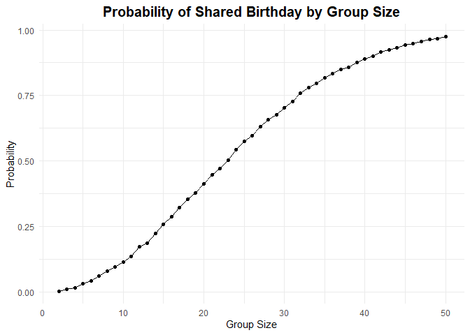
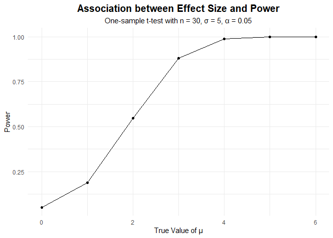
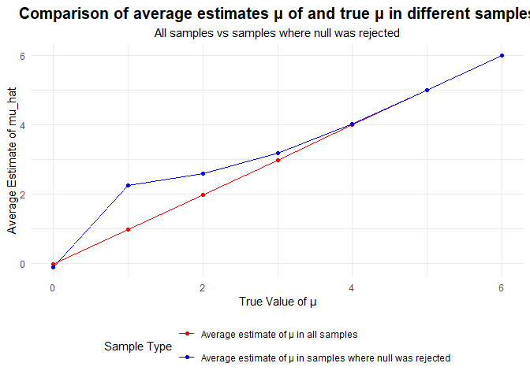
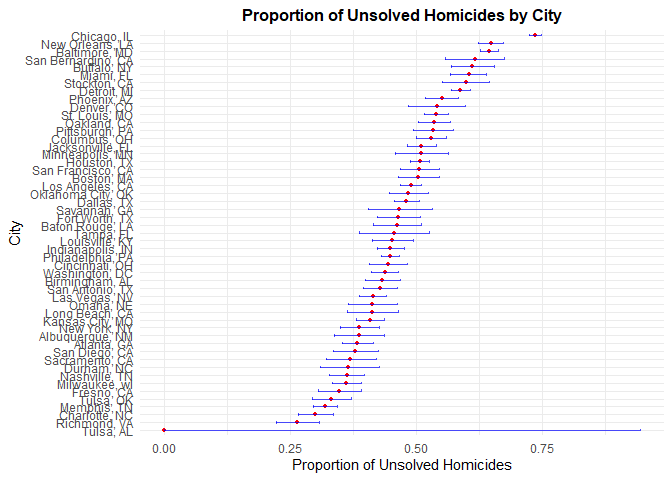

p8105_hw5_bz2570
================
Boran Zhai
2025-11-06

## Problem 1

``` r
birthday_sim <- function(group_size) {
  birthdays <- sample(1:365, group_size, replace = TRUE)
  repeated_bday <- length(unique(birthdays)) < group_size
  repeated_bday
}

bday_sim_results =
  expand_grid(
    bdays = 2:50,
    iter = 1:10000
  ) |>
  mutate(
    result = map_lgl(bdays, birthday_sim)
  ) |>
  group_by(
    bdays
  ) |>
  summarize(
    prob_repeat = mean(result)
  )
knitr::kable(head(bday_sim_results, 10), caption = "Birthday simulation results (Only showing first 10 rows)", digits = 4)
```

| bdays | prob_repeat |
|------:|------------:|
|     2 |      0.0026 |
|     3 |      0.0093 |
|     4 |      0.0159 |
|     5 |      0.0304 |
|     6 |      0.0415 |
|     7 |      0.0597 |
|     8 |      0.0805 |
|     9 |      0.0947 |
|    10 |      0.1150 |
|    11 |      0.1364 |

Birthday simulation results (Only showing first 10 rows)

``` r
bday_sim_results |>
  ggplot(aes(x = bdays, y = prob_repeat)) +
  geom_point() +
  geom_line() +
  labs(
    title = "Probability of Shared Birthday by Group Size", 
    x = "Group Size",
    y = "Probability"
  ) +
  theme_minimal() +
  theme(plot.title = element_text(hjust = 0.5, face = "bold", size = 15))
```

<!-- -->

#### Comment on results:

The probability of shared birthday grows obviously with group size,
especially between group size of 10 and 35. For a group size of 23, the
probability of at least two people sharing a birthday exceeds 50%. By
group size 35, the probability exceeds 90%, and reaches near 1.00 (0.97)
by group size 50.

## Problem 2

``` r
# Set design elements:
n <- 30
sigma <- 5
alpha <- 0.05
# Set μ = 0. Generate 5000 datasets
mu_true_values <- c(0)
n_sims <- 5000
```

``` r
# Write a function
power_sim <- function(true_mu, n, sigma, n_sims) {
  results <- 
    expand_grid(
      mu = true_mu,           # The true value of mu
      iter = 1:n_sims
    ) |> 
    mutate(
      x = map(mu, ~rnorm(n, mean = .x, sd = sigma)),
      t_test = map(x, ~t.test(.x, mu = 0)),
      tidy_result = map(t_test, broom::tidy)
    ) |> 
    unnest(tidy_result) |> 
    
    select(mu, mu_hat = estimate, p_value = p.value)
  return(results)
}

sim_results_0 <- power_sim(mu_true_values, n, sigma, n_sims)
```

``` r
mu_true_values_add <- c(1, 2, 3, 4, 5, 6)
sim_results_add <-  power_sim(mu_true_values_add, n, sigma, n_sims)
# Combine results
sim_results <- bind_rows(sim_results_0, sim_results_add)
```

``` r
summary_stats <- 
  sim_results |> 
  group_by(mu) |> 
  summarize(
    avg_mu_hat = mean(mu_hat),           # Average estimate from all samples
    power = mean(p_value < alpha),        # The proportion of times the null was rejected
    avg_mu_hat_rejected = mean(mu_hat[p_value < alpha]),   
    # Average estimate of mu_hat only in samples for which the null was rejecte
    n_rejected = sum(p_value < alpha)     # Number of samples for which the null was rejected
  )
knitr::kable(summary_stats)
```

|  mu | avg_mu_hat |  power | avg_mu_hat_rejected | n_rejected |
|----:|-----------:|-------:|--------------------:|-----------:|
|   0 | -0.0070009 | 0.0514 |          -0.1015931 |        257 |
|   1 |  0.9964707 | 0.1898 |           2.2511888 |        949 |
|   2 |  1.9763759 | 0.5472 |           2.6114504 |       2736 |
|   3 |  2.9934642 | 0.8810 |           3.1912463 |       4405 |
|   4 |  4.0068404 | 0.9868 |           4.0370034 |       4934 |
|   5 |  5.0116598 | 0.9996 |           5.0129285 |       4998 |
|   6 |  6.0141538 | 1.0000 |           6.0141538 |       5000 |

``` r
power_plot <- 
  ggplot(summary_stats, aes(x = mu, y = power)) +
  geom_line() +
  geom_point() +
  labs(
    title = "Association between Effect Size and Power",
    subtitle = "One-sample t-test with n = 30, σ = 5, α = 0.05",
    x = "True Value of μ",
    y = "Power"
  ) +
  theme_minimal() +
  theme(plot.title = element_text(hjust = 0.5, face = "bold", size = 15),
        plot.subtitle = element_text(hjust = 0.5))

print(power_plot)
```

<!-- -->

##### Describe the association between effect size and power

In this one-sample t-test, there is a strong positive association
between effect size (true μ) and statistical power. The plot shows a
sharp increase in power as μ rises from 1 to 4: starting at 0.19 when μ
= 1, increasing to 0.547 at μ = 2, 0.881 at μ = 3, and reaching 0.987 at
μ = 4. Beyond μ = 4, the curve flattens significantly, with power
approaching 1 by μ = 6.

``` r
# Make two plot showing the average estimate of μ and the true value of μ / the average estimate of μ only in samples for which the null was rejected and the true value of μ
comparison_plot <- 
  ggplot(summary_stats) +
  geom_line(aes(x = mu, y = avg_mu_hat, color = "Average estimate of μ in all samples")) +
  geom_point(aes(x = mu, y = avg_mu_hat, color = "Average estimate of μ in all samples")) +
  geom_line(aes(x = mu, y = avg_mu_hat_rejected, color = "Average estimate of μ in samples where null was rejected")) +
  geom_point(aes(x = mu, y = avg_mu_hat_rejected, color = "Average estimate of μ in samples where null was rejected")) +
  labs(
    title = "Comparison of average estimates μ of and true μ in different samples",
    subtitle = "All samples vs samples where null was rejected",
    x = "True Value of μ",
    y = "Average Estimate of mu_hat",
    color = "Sample Type"
  ) +
  theme_minimal() +
  scale_color_manual(
    values = c("Average estimate of μ in all samples" = "red", 
               "Average estimate of μ in samples where null was rejected" = "blue")
  ) +
  theme(plot.title = element_text(hjust = 0.5, face = "bold", size = 15),
        plot.subtitle = element_text(hjust = 0.5),
        legend.position = "bottom") +
  guides(color = guide_legend(nrow = 2)) 
  
print(comparison_plot)
```

<!-- -->

##### Is the sample average of mu_hat across tests for which the null is rejected approximately equal to the true value of μ? Why or why not?

No, the sample average of mu_hat across tests for which the null is
rejected is not completely equal to the true value of μ, particularly
for smaller effect sizes. This discrepancy arises from selection bias.
When we condition on rejecting the null hypothesis, we select samples
where mu_hat is extreme enough to be statistically significant. For μ =
1, the average mu_hat in rejected samples is 2.251 compared to the true
value of 1 (bias = 1.251). As μ increases to 6, the bias decreases to
0.014. This occurs because with small effects, only the unusually large
estimates are significant enough to reject the null, while with large
effects, almost every sample shows a significant result.

## Problem 3

``` r
homicide_data = read_csv("data/homicide-data.csv")
```

    ## Rows: 52179 Columns: 12
    ## ── Column specification ────────────────────────────────────────────────────────
    ## Delimiter: ","
    ## chr (9): uid, victim_last, victim_first, victim_race, victim_age, victim_sex...
    ## dbl (3): reported_date, lat, lon
    ## 
    ## ℹ Use `spec()` to retrieve the full column specification for this data.
    ## ℹ Specify the column types or set `show_col_types = FALSE` to quiet this message.

#### Describe the raw data.

The raw dataset contains 52179 homicide records and 12 variables. Key
variables include victim demographics like *name, age, race, sex*,
geographic information like *city, state, lat, lon*, and *disposition*
(which indicates whether cases were closed by arrest, closed without
arrest, or remain open).

#### Create city_state variable and summarize

``` r
city_homicides <- 
  homicide_data |>
  janitor::clean_names() |> 
  mutate(
    city_state = str_c(city, ", ", state)       # Create city_state variable
  ) |> 
  group_by(city_state) |> 
  summarize(
    total_homicides = n(),  # Total number of homicides
    unsolved_homicides = sum(disposition %in% c("Closed without arrest", "Open/No arrest"))  # Number of unsolved homicides
  )

knitr::kable(city_homicides)
```

| city_state         | total_homicides | unsolved_homicides |
|:-------------------|----------------:|-------------------:|
| Albuquerque, NM    |             378 |                146 |
| Atlanta, GA        |             973 |                373 |
| Baltimore, MD      |            2827 |               1825 |
| Baton Rouge, LA    |             424 |                196 |
| Birmingham, AL     |             800 |                347 |
| Boston, MA         |             614 |                310 |
| Buffalo, NY        |             521 |                319 |
| Charlotte, NC      |             687 |                206 |
| Chicago, IL        |            5535 |               4073 |
| Cincinnati, OH     |             694 |                309 |
| Columbus, OH       |            1084 |                575 |
| Dallas, TX         |            1567 |                754 |
| Denver, CO         |             312 |                169 |
| Detroit, MI        |            2519 |               1482 |
| Durham, NC         |             276 |                101 |
| Fort Worth, TX     |             549 |                255 |
| Fresno, CA         |             487 |                169 |
| Houston, TX        |            2942 |               1493 |
| Indianapolis, IN   |            1322 |                594 |
| Jacksonville, FL   |            1168 |                597 |
| Kansas City, MO    |            1190 |                486 |
| Las Vegas, NV      |            1381 |                572 |
| Long Beach, CA     |             378 |                156 |
| Los Angeles, CA    |            2257 |               1106 |
| Louisville, KY     |             576 |                261 |
| Memphis, TN        |            1514 |                483 |
| Miami, FL          |             744 |                450 |
| Milwaukee, wI      |            1115 |                403 |
| Minneapolis, MN    |             366 |                187 |
| Nashville, TN      |             767 |                278 |
| New Orleans, LA    |            1434 |                930 |
| New York, NY       |             627 |                243 |
| Oakland, CA        |             947 |                508 |
| Oklahoma City, OK  |             672 |                326 |
| Omaha, NE          |             409 |                169 |
| Philadelphia, PA   |            3037 |               1360 |
| Phoenix, AZ        |             914 |                504 |
| Pittsburgh, PA     |             631 |                337 |
| Richmond, VA       |             429 |                113 |
| Sacramento, CA     |             376 |                139 |
| San Antonio, TX    |             833 |                357 |
| San Bernardino, CA |             275 |                170 |
| San Diego, CA      |             461 |                175 |
| San Francisco, CA  |             663 |                336 |
| Savannah, GA       |             246 |                115 |
| St. Louis, MO      |            1677 |                905 |
| Stockton, CA       |             444 |                266 |
| Tampa, FL          |             208 |                 95 |
| Tulsa, AL          |               1 |                  0 |
| Tulsa, OK          |             583 |                193 |
| Washington, DC     |            1345 |                589 |

**For the city of Baltimore, MD**

``` r
baltimore_df <- 
  city_homicides |>  
  filter(city_state == "Baltimore, MD")

# Use prop.test function to estimate the proportion of homicides that are unsolved and save the output
baltimore_prop_test <- prop.test(
  x = baltimore_df$unsolved_homicides,
  n = baltimore_df$total_homicides
)

# Display the estimated proportion and confidence intervals from the resulting tidy dataframe
tidy_baltimore_test <- broom::tidy(baltimore_prop_test)
tidy_baltimore_test |> 
  select(estimated_proportion = estimate, 
         CI_lower = conf.low,
         CI_upper = conf.high) |> 
  knitr::kable(digits = 4)
```

| estimated_proportion | CI_lower | CI_upper |
|---------------------:|---------:|---------:|
|               0.6456 |   0.6276 |   0.6632 |

The estimated proportion of unsolved homicides in Baltimore, MD is r
round(tidy_baltimore_test$estimate, 4), with a 95% confidence interval of (r round(tidy_baltimore_test$conf.low,
4), r round(tidy_baltimore_test\$conf.high, 4)).

**For all cities**

``` r
# Run prop.test for each of the cities
city_prop_tests <- 
  city_homicides |>  
  mutate(
    prop_test = map2(unsolved_homicides, total_homicides, 
                    ~prop.test(x = .x, n = .y)),
    tidy_results = map(prop_test, broom::tidy)
  ) |> 
  unnest(tidy_results) |> 
  select(
    city_state, 
    total_homicides,
    unsolved_homicides,
    proportion_unsolved = estimate, 
    CI_lower = conf.low,
    CI_upper = conf.high
  )
```

    ## Warning: There was 1 warning in `mutate()`.
    ## ℹ In argument: `prop_test = map2(...)`.
    ## Caused by warning in `prop.test()`:
    ## ! Chi-squared approximation may be incorrect

``` r
knitr::kable(city_prop_tests, digits = 4)
```

| city_state | total_homicides | unsolved_homicides | proportion_unsolved | CI_lower | CI_upper |
|:---|---:|---:|---:|---:|---:|
| Albuquerque, NM | 378 | 146 | 0.3862 | 0.3373 | 0.4376 |
| Atlanta, GA | 973 | 373 | 0.3834 | 0.3528 | 0.4148 |
| Baltimore, MD | 2827 | 1825 | 0.6456 | 0.6276 | 0.6632 |
| Baton Rouge, LA | 424 | 196 | 0.4623 | 0.4142 | 0.5110 |
| Birmingham, AL | 800 | 347 | 0.4338 | 0.3992 | 0.4690 |
| Boston, MA | 614 | 310 | 0.5049 | 0.4646 | 0.5451 |
| Buffalo, NY | 521 | 319 | 0.6123 | 0.5688 | 0.6541 |
| Charlotte, NC | 687 | 206 | 0.2999 | 0.2661 | 0.3359 |
| Chicago, IL | 5535 | 4073 | 0.7359 | 0.7240 | 0.7474 |
| Cincinnati, OH | 694 | 309 | 0.4452 | 0.4080 | 0.4831 |
| Columbus, OH | 1084 | 575 | 0.5304 | 0.5002 | 0.5605 |
| Dallas, TX | 1567 | 754 | 0.4812 | 0.4562 | 0.5062 |
| Denver, CO | 312 | 169 | 0.5417 | 0.4846 | 0.5977 |
| Detroit, MI | 2519 | 1482 | 0.5883 | 0.5688 | 0.6076 |
| Durham, NC | 276 | 101 | 0.3659 | 0.3096 | 0.4261 |
| Fort Worth, TX | 549 | 255 | 0.4645 | 0.4223 | 0.5072 |
| Fresno, CA | 487 | 169 | 0.3470 | 0.3051 | 0.3914 |
| Houston, TX | 2942 | 1493 | 0.5075 | 0.4892 | 0.5257 |
| Indianapolis, IN | 1322 | 594 | 0.4493 | 0.4223 | 0.4766 |
| Jacksonville, FL | 1168 | 597 | 0.5111 | 0.4820 | 0.5401 |
| Kansas City, MO | 1190 | 486 | 0.4084 | 0.3804 | 0.4370 |
| Las Vegas, NV | 1381 | 572 | 0.4142 | 0.3881 | 0.4407 |
| Long Beach, CA | 378 | 156 | 0.4127 | 0.3629 | 0.4643 |
| Los Angeles, CA | 2257 | 1106 | 0.4900 | 0.4692 | 0.5109 |
| Louisville, KY | 576 | 261 | 0.4531 | 0.4121 | 0.4948 |
| Memphis, TN | 1514 | 483 | 0.3190 | 0.2957 | 0.3433 |
| Miami, FL | 744 | 450 | 0.6048 | 0.5686 | 0.6400 |
| Milwaukee, wI | 1115 | 403 | 0.3614 | 0.3333 | 0.3905 |
| Minneapolis, MN | 366 | 187 | 0.5109 | 0.4585 | 0.5631 |
| Nashville, TN | 767 | 278 | 0.3625 | 0.3286 | 0.3977 |
| New Orleans, LA | 1434 | 930 | 0.6485 | 0.6231 | 0.6732 |
| New York, NY | 627 | 243 | 0.3876 | 0.3494 | 0.4271 |
| Oakland, CA | 947 | 508 | 0.5364 | 0.5041 | 0.5685 |
| Oklahoma City, OK | 672 | 326 | 0.4851 | 0.4468 | 0.5236 |
| Omaha, NE | 409 | 169 | 0.4132 | 0.3653 | 0.4627 |
| Philadelphia, PA | 3037 | 1360 | 0.4478 | 0.4300 | 0.4657 |
| Phoenix, AZ | 914 | 504 | 0.5514 | 0.5185 | 0.5839 |
| Pittsburgh, PA | 631 | 337 | 0.5341 | 0.4943 | 0.5735 |
| Richmond, VA | 429 | 113 | 0.2634 | 0.2229 | 0.3083 |
| Sacramento, CA | 376 | 139 | 0.3697 | 0.3212 | 0.4209 |
| San Antonio, TX | 833 | 357 | 0.4286 | 0.3948 | 0.4630 |
| San Bernardino, CA | 275 | 170 | 0.6182 | 0.5577 | 0.6753 |
| San Diego, CA | 461 | 175 | 0.3796 | 0.3354 | 0.4258 |
| San Francisco, CA | 663 | 336 | 0.5068 | 0.4681 | 0.5454 |
| Savannah, GA | 246 | 115 | 0.4675 | 0.4041 | 0.5319 |
| St. Louis, MO | 1677 | 905 | 0.5397 | 0.5154 | 0.5637 |
| Stockton, CA | 444 | 266 | 0.5991 | 0.5517 | 0.6447 |
| Tampa, FL | 208 | 95 | 0.4567 | 0.3881 | 0.5270 |
| Tulsa, AL | 1 | 0 | 0.0000 | 0.0000 | 0.9454 |
| Tulsa, OK | 583 | 193 | 0.3310 | 0.2932 | 0.3711 |
| Washington, DC | 1345 | 589 | 0.4379 | 0.4112 | 0.4649 |

Across all cities, the proportion of unsolved homicides ranges from r
round(min(city_prop_tests$proportion_unsolved), 4) to r round(max(city_prop_tests$proportion_unsolved),
4), with 95% confidence intervals shown in the table above.

``` r
# Create a plot that shows the estimates and CIs for each city
city_plot <- 
  city_prop_tests |>
  # Organize cities according to the proportion of unsolved homicides
  mutate(city_state = fct_reorder(city_state, proportion_unsolved)) |> 
  ggplot(aes(x = proportion_unsolved, y = city_state)) +
  # Add points for the estimates
  geom_point(color = "red", size = 1) +
  # Add error bars based on the upper and lower limits
  geom_errorbar(aes(xmin = CI_lower, xmax = CI_upper), 
                width = 0.3, color = "blue", alpha = 0.7) +
  labs(
    title = "Proportion of Unsolved Homicides by City",
    x = "Proportion of Unsolved Homicides",
    y = "City"
  ) +
  theme_minimal() +
  theme(plot.title = element_text(hjust = 0.5, face = "bold", size = 12),
        plot.subtitle = element_text(hjust = 0.5))

print(city_plot)
```

<!-- -->

This plot shows the proportion of unsolved homicides by city. Each city
has a red dot indicating the proportion with error bars, depicting the
variation in unsolved homicide proportions across various cities.
